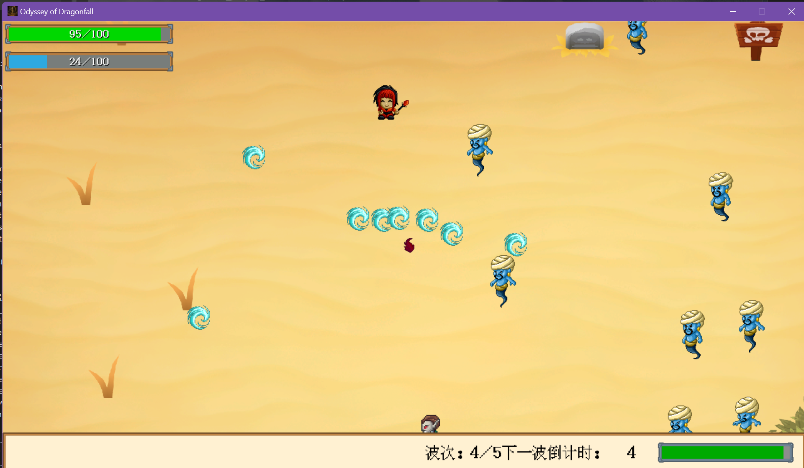
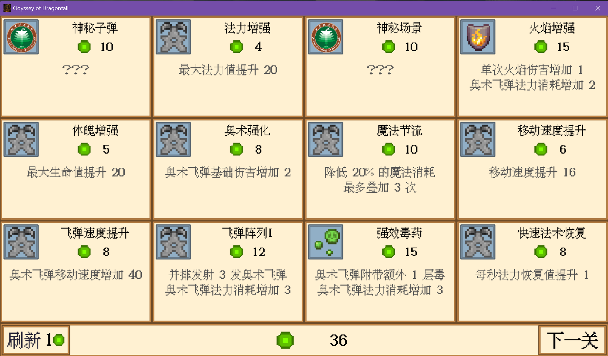
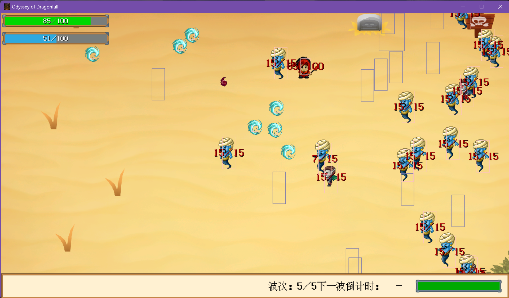
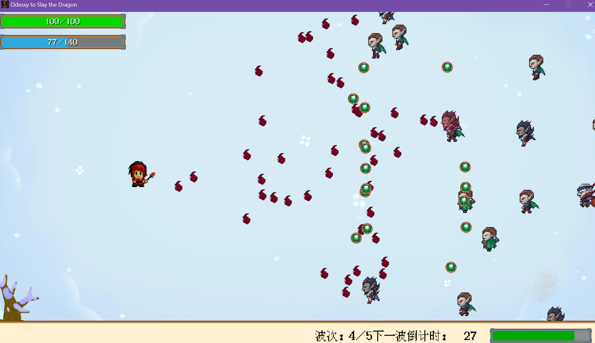

# 十行代码 2026  赛道二 参赛作品 Odyssey of Dragonfall

## 一、环境说明

### 运行环境

本游戏为 Win32 应用程序, 只能在 Windows 操作系统上运行

### 开发环境

| 操作系统                             | 编译器                                    | IDE                                                          |
| ------------------------------------ | ----------------------------------------- | ------------------------------------------------------------ |
| Windows 11 家庭中文版 23H222631.6199 | g++ (Rev8, Built by MSYS2 project) 15.2.0 | Microsoft Visual Studio Community 2022 (64 位) - Current 版本 17.13.4 |

附件中带有完整的 VS 项目开发文件, 直接双击 .sln 后缀的文件就可以打开解决方案并查看项目代码; 但是如果需要编译程序, 则需要安装 easyx 图形库, 可以参考链接[EasyX_2023大暑版下载](https://easyx.cn/easyx-20230723), 这一版本与我所使用的 easyx 版本相同. 如果使用 Visual Studio 2022 打开项目, 应该会自动加载项目设置, 如果没有, 则需要设置项目字符集为 unicode, 平台为 win32, 链接器系统选项设为 /Subsystem:Windows.

## 二、游戏介绍

### 基本玩法

北理工的恶龙再次出现, 我们的勇士挺身而出, 学习魔法, 再度击败恶龙.

游戏玩法为平面设计 + roguelike. WASD 移动, 左键近战攻击, 右键消耗魔法攻击. 游戏一共 10 关, 击败第 10 关关底的 BOSS 巨龙即可通关. 每关结束后会获得一定量经验, 可以在关卡之间的技能选择界面消耗经验学习技能. 游戏有 4 种属性元素, 分别为快速造成伤害的火;高消耗但可叠加伤害的毒; 降低敌人攻击速度和移动速度的冰; 降低敌人伤害的咒; 相关的属性伤害需要靠技能解锁, 每局最多解锁两种元素相关的技能, 并可以在解锁两种元素技能后可以解锁相应的组合技能, 例如火与毒的组合技能"毒性催发"可以使着火的敌人受到双倍伤害. 此外还有一些与基础属性相关的技能. 游戏画面可以参考下面的图片

游戏种按 F1 后可以进入 debug 模式, 显示碰撞箱和血量

### 游戏攻略

目前游戏玩法上的打磨不足, 技能不算平衡, 这也是后面的改进方向之一; 游戏目前存在一些轮椅技能, 毒属性 DOT 伤害很高, 前期怪物基本上都能被毒死. 扇形飞弹、飞弹阵列可以增加子弹数量, 中后期可以依靠大量子弹对付群怪, 二者组合可以依靠攻杀快速清理后面的怪海; 但这样做魔耗非常高, 因此最好从第一关开始就逐渐选一些降低魔耗或者是回蓝的技能.

### 设计简述

* 游戏场景和敌人 AI 均通过状态机实现.
* 游戏玩家和敌人子弹的碰撞箱比外观小; 这样可以给玩家更舒适的视觉提示
* 血量变少时血条会变红
* 右下角显示关卡进度条和波次信息
* 吸血鬼发射的深红色子弹会吸血, 恢复造成伤害的 50% 的血量
* 巨龙拥有两种招式, 发射扇形子弹和一整排的龙息; 龙息命中后会附带火焰
* 敌人的血量、攻击力、移动速度、子弹速度和攻击频率会随着关卡推进而提高

### 赤石点

游戏种有两个神奇的技能, 分别叫"神秘子弹"和"神秘场景"; 解锁它们以后可以分别将角色的子弹替换为北理的校徽、游戏背景替换为文翠楼的地图. 神秘子弹的效果可以参考下图.

## 三、AIGC 说明

游戏的部分美术素材, 例如游戏 icon、游戏封面和巨龙的美术素材就是由 ChatGPT 的新图像模型生成的, 游戏封面被毁的建筑物就是文萃楼

scene_skillselect.cpp 的 on_render() 方法和 ElderVampire、ElderOfShadow、Dragon 的攻击模组代码由 Copilot 生成; 这些功能易于描述但实现复杂, 用 Copilot 帮助非常方便. 其余部分均由我自己通过古法编程实现.

## 四、未来改进方向

这款游戏是我利用五一假期集中完成的, 前后总耗时约整整 8 天, 项目灵感主要来自 Hades 系列、背包乱斗, 都是很优秀的 roguelike 游戏. 然而遗憾的是, 游戏的工作量超出了我的想象, 仅仅是目前的体量就已经达到了 7200 行代码, 这 8 天几乎全部精力都花在了代码的实现上, 没有时间打磨游戏体验, 平衡性不好, 一些原先的设想也未能实现. 最开始, 我想设计更丰富的游戏技能的联动并吸取背包乱斗的"大小转职"设计, 优化 roguelike 体验. 然而时间不足以让我完成这样庞大的工作量了. 在我的设想中, 玩家可以学习两个主动技能, 并选择一个转职, 例如如果选了"黑暗献祭"的法术技能, 可以消耗生命提高自己的攻击力; 而转职"堕落法师"可以随着失去血量的百分比提高伤害, 并解锁更多与控制血量相关的黑魔法技能组. 这样的小技能随机 + 不随机的分阶段的转职设计可以优化 rogue 体验.

目前游戏尚存在个别 bug, 包括但不限于虽然当玩家解锁两种属性后不会刷新其他属性的技能, 但是实际上游戏可能直接刷新出三种属性的技能.

虽然本作品是为了参赛而设计准备的, 但是做游戏是我的个人兴趣, 这也是我个人的第五部作品. 我对这个方向玩法也具有一定的想法, 之后也会陆续更新下去, 虽然不能作为赛事成果, 但是后续我还会抽时间更新本项目. 

## 五、使用素材说明

* 使用了部分 AI 生成的游戏素材, 已在第三节 AIGC 中说明
* UI 素材来自[Kenney 的免费素材包](https://kenney.nl/assets/ui-pack-pixel-adventure)
* 角色素材来自 https://craftpix.net/ 上的免费素材包
* 音乐素材来自以下游戏的原声音轨: 《上古卷轴V: 天际》,《Hades II》, 《Nier: Automata》, 《Dead Cells》, 《Ori》，《磁带妖怪》, 《Chants Of Sennar》
